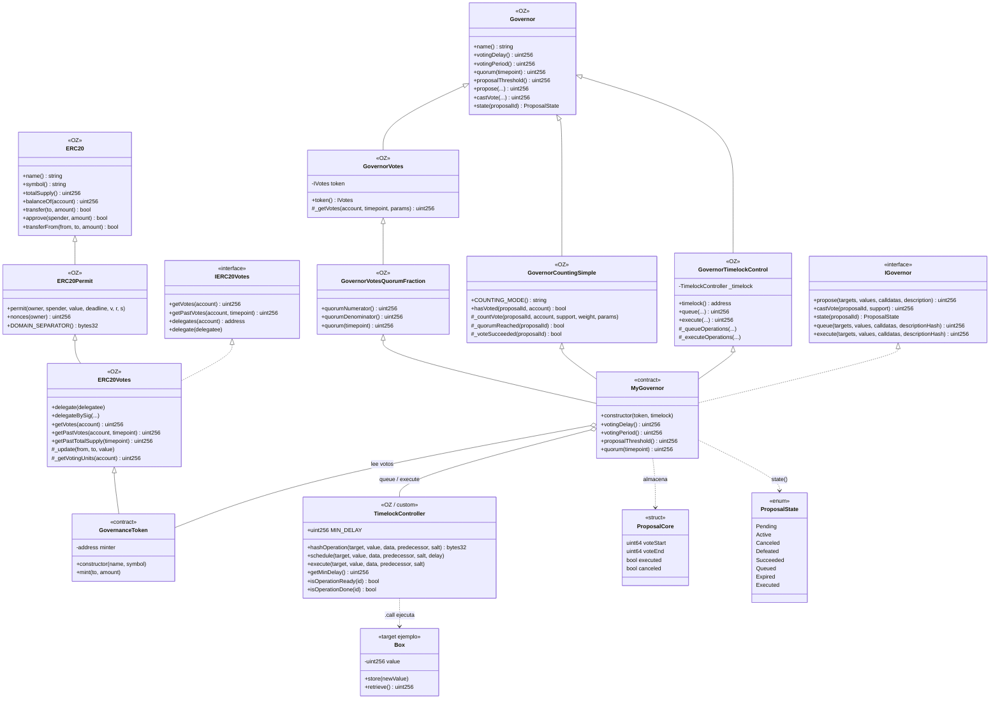

# Diagrama de clases — DAO Governance & Timelock

Vista estructural de contratos, herencia OpenZeppelin y relaciones de composición/uso.

## Diagrama (Mermaid)

## Relaciones clave

| Desde | Hacia | Tipo | Motivo |
|-------|-------|------|--------|
| `MyGovernor` | `GovernanceToken` | Asociación | `getPastVotes` en el snapshot de la propuesta |
| `MyGovernor` | `TimelockController` | Asociación | Solo propuestas exitosas se encolan/ejecutan con delay |
| `TimelockController` | Targets (`Box`, etc.) | Dependencia | Ejecución arbitraria segura vía low-level `.call` |
| `GovernanceToken` | Checkpoints internos | Composición (OZ) | Historial de poder de voto por bloque/timepoint |

## Notas de diseño

1. **Herencia OZ v5**: reutilizar módulos auditados; no reinventar counting/quorum/timelock control.
2. **Roles Timelock**: `PROPOSER_ROLE` → Governor; `EXECUTOR_ROLE` → `address(0)` o roles acotados; renunciar `DEFAULT_ADMIN_ROLE` tras setup.
3. **Separación de concerns**: el token no conoce propuestas; el Governor no ejecuta lógica de negocio; el Timelock es el único caller privilegiado hacia targets.
