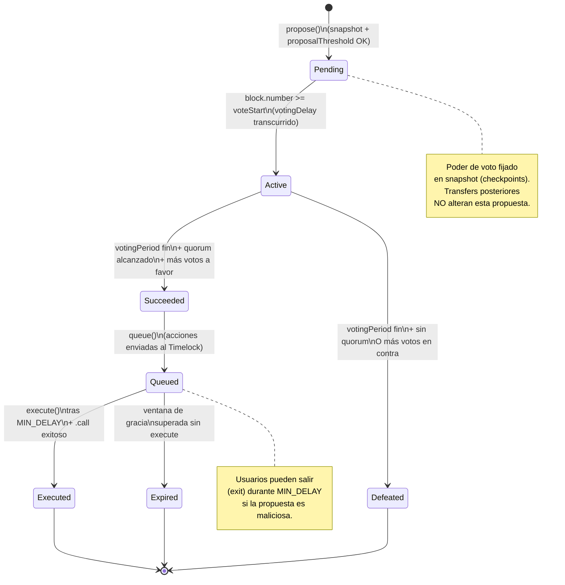
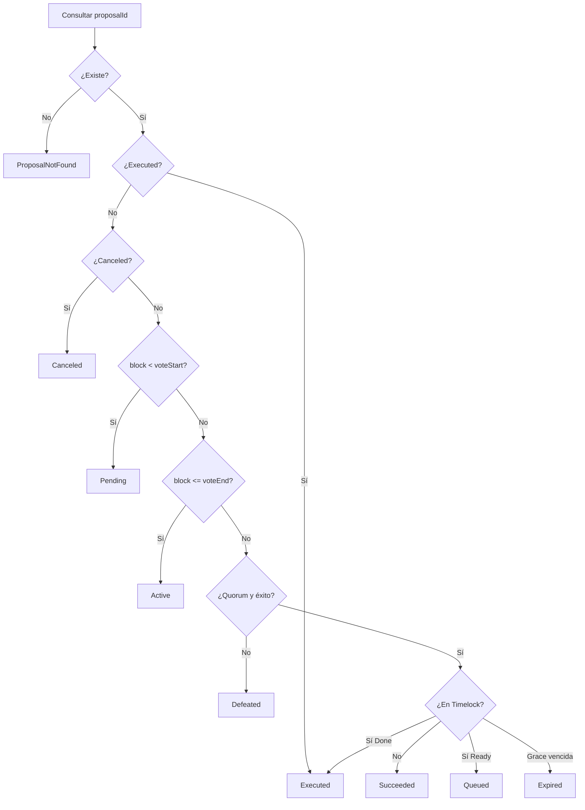

# Diagrama de flujo — Máquina de estados de la propuesta

Transiciones oficiales del ciclo de vida de una propuesta DAO (módulo 10).

## Diagrama (Mermaid)

## Tabla de transiciones

| Estado actual | Condición | Estado siguiente | Error si se viola |
|---------------|-----------|------------------|-------------------|
| — | `getVotes(proposer) >= proposalThreshold` | `Pending` | (custom: umbral / no autorizado) |
| `Pending` | `block >= voteStart` | `Active` | — (solo lectura de `state`) |
| `Active` | Periodo abierto | sigue `Active` | `VotingClosed` si se intenta fuera |
| `Active` | Fin + quorum + for > against | `Succeeded` | — |
| `Active` | Fin + fallo quorum/votos | `Defeated` | — |
| `Succeeded` | `queue(...)` | `Queued` | `ProposalNotSucceeded` |
| `Queued` | `now < eta` (delay) | sigue `Queued` | `MinDelayNotMet` al execute |
| `Queued` | delay OK + `.call` OK | `Executed` | `ExecutionFailed` |
| `Queued` | grace period vencido | `Expired` | — |
| cualquier | `proposalId` inválido | — | `ProposalNotFound` |

## Flujo de decisión de `state(proposalId)`

## Invariantes

1. Una propuesta **nunca** salta de `Active` a `Executed` sin pasar por `Succeeded` → `Queued`.
2. El peso de voto se lee con `getPastVotes(account, snapshot)` — no con balance actual.
3. Toda ejecución on-chain de acciones de propuesta pasa por Timelock + `MIN_DELAY`.
