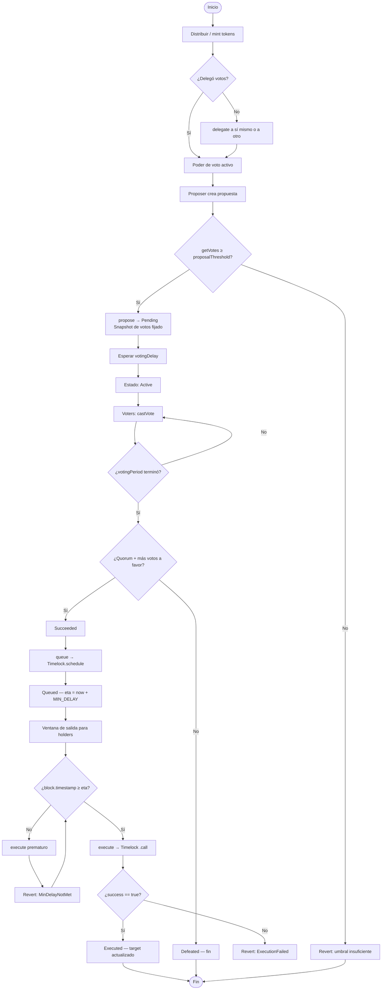
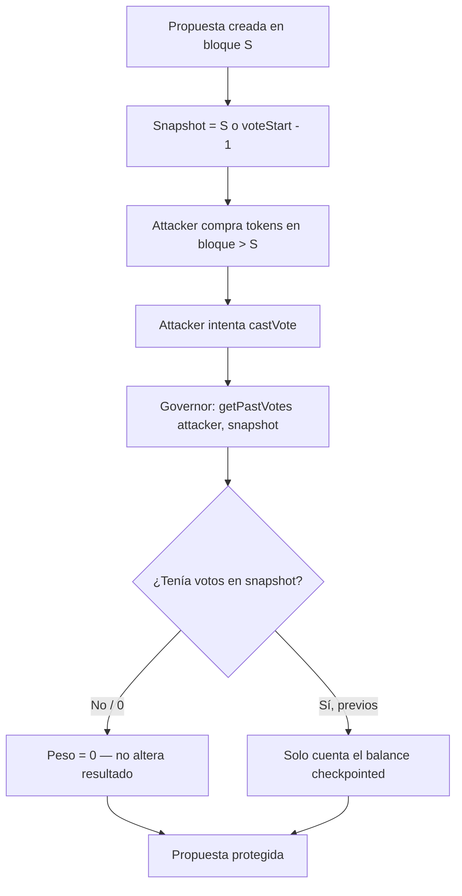
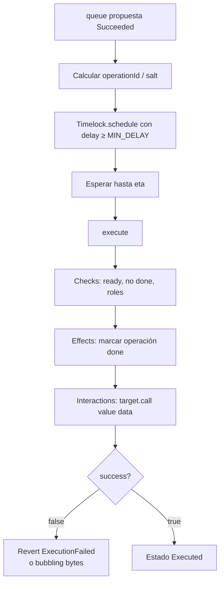
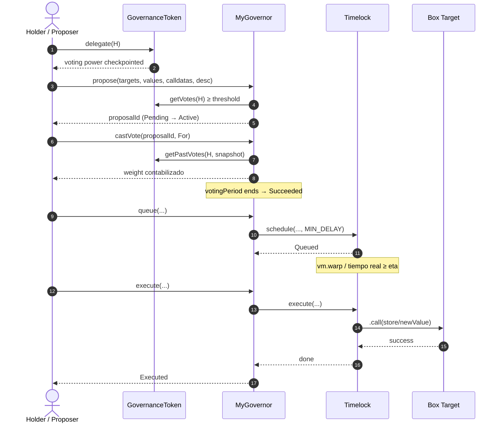

# Flujograma — Ciclo completo de gobernanza DAO

Flujo extremo a extremo entre actores y contratos: desde la delegación hasta la ejecución en el target.

## Actores

| Actor | Rol |
|-------|-----|
| Token Holder | Posee `GovernanceToken`; debe delegar para votar |
| Proposer | Holder con votos ≥ `proposalThreshold` |
| Voter | Holder (o delegado) que vota For / Against / Abstain |
| Anyone / Executor | Quien llama `queue` / `execute` tras las condiciones |
| Timelock | Contrato que impone `MIN_DELAY` y ejecuta `.call` |
| Target | Contrato gobernado (ej. `Box`) |

---

## Flujograma principal (Mermaid)

---

## Flujograma anti flash-loan / double voting

---

## Flujograma de ejecución Timelock (detalle)

---

## Secuencia simplificada (Delegate → Execute)

---

## Resumen operativo

1. **Sin `delegate`, no hay voto** — el balance ERC-20 solo no basta.
2. **Snapshot al crear / al inicio de voto** — transfers posteriores no cuentan para esa propuesta.
3. **Éxito de votación ≠ ejecución inmediata** — siempre Timelock + `MIN_DELAY`.
4. **`.call` verificado** — fallo de target ⇒ `ExecutionFailed`.
5. **Tests Foundry** deben recorrer este flujograma completo y los caminos de error (`MinDelayNotMet`, `VotingClosed`, `ProposalNotFound`, `ProposalNotSucceeded`).
